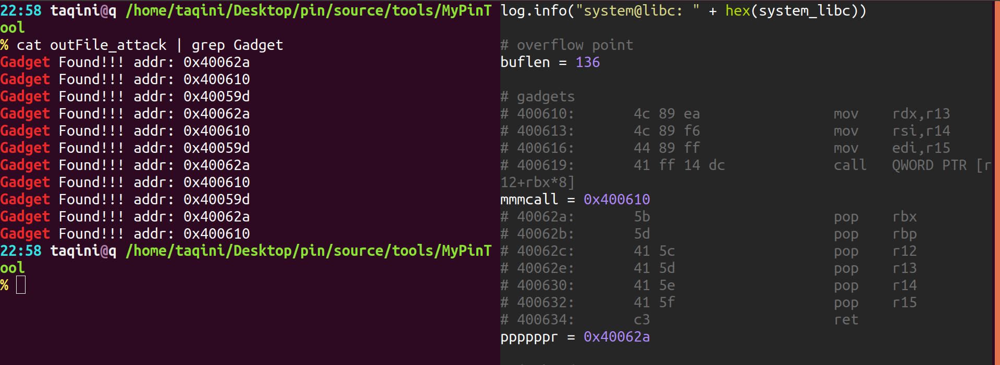

# Environment: my ubuntu 18.04
	- 64-bit Ubuntu
	- kernel: 4.15.0-45-generic
    - arch: x86\_64
	- relaese: 18.04.2

# question
## paper translation
 1. Ropper 是否是有限制地搜索gadget，例如只搜索长度小于6的gadget
 -> 漏掉 size>6, 且含有padding的可用gadget
'''
  --inst-count <n bytes>
                        Specifies the max count of instructions in a gadget
                        (default: 6)
'''
 ans: 确有限制，default max=6
 此处为ROP:Hunt一文之疏忽。
'''
  [!] In the gadget set generated by Ropper, the largest size is 6.
'''
 此后提出的delay gadget, ROP Hunt选择忽略，若将payload整合进delay gadget，则可以实现绕过Hunt检测。

 2. gadget, runtime 之类的术语是否需要翻译？
  - 不了
 3. prototype 如何翻译
  - 原型
 4. signature decetor 是啥 reset counter 啥意思？
  - 長度特徵檢測器, 用於識別連續gadget

# Current method of ROP detection from (2015 ISC)
 1. 栈迁移检测 StackPviot: check if stack is pviotted 
 2. (II)调用返回成对 Caller:check if critical functions was called and not returned into 
 3. 模拟执行流 SimExecFlow:Simulate the execution flow after the return address to detect subsequent ROP Gadgets
 4. 内存保护 MemProt:specail check on memory protections API
 5. （无关紧要）库加载 LoadLib:check and prevent LoadLibrary calls againts UNC paths
 6. (II)基于统计学方法，设置阈值。
 7. (II)类似2，检测是否调用系统调用（在出现gadget后）应该是为了防误报
 8. (II)入口地址比对法，判断gadget。
## analysis文章中的分类
 1. Control Flow Integrity 控制流完整性 - 较为底层
 2. Instruction Monitoring 检测指令 
  - 静态：编译是在特殊指令后加一个call 
  - 动态：在虚拟机中运行程序,或PIN之类的框架
 3. Input Scanning         扫描用户输入
 4. Instruction Rewriting  指令重构
 5. Memory Randomization.  内存随机化

# feature of gadget
 1. 短（长的用副作用）
 2. 不是程序入口地址（从入口执行至ret，相当于又调用了一边函数，可能会对程序产生影响，但是只利用这种gadget，不进行其他栈操作，进行不了有意义的攻击）
 - 有意思的点：据统计程序开始后的前5条指令，不含ret。(来自DBI那篇文章)

# Thought of Implementation 
 - pass1 静态分析，信息获取（自身信息：符号表,可用gadget,环境信息：用的哪个链接库,库中含大量gadget...）。
 - pass2 动态检测，根据静态分析信息，动态调整阈值。不用固定阈值，增加了检测器的适用范围，较少了前提假设的数量，感觉甚至可以不做关于阈值的前提假设。
 - above: 这种思想PIN已经想到,动态：JIT mode，静态：Probe mode。不谋而合呀！

 - ! that is a break point to ROP-Hunt
 - new feature: adjust Threshold dynamically __改进点在此__
 - 工作流程：对保护的应用，先做一次体检，然后再动态保护之。
 - 如果程序及运行环境不更新，因为静态分析是在应用运行前完成的，所以不会增加动态保护时，程序runtime资源的消耗。获取信息也可以动态进行，但是耗费runtime资源，所以要动态获取尽可能少的必要资源，其余的交给静态。p.s.如果开启了地址随机化，就静态获取offset，动态获取动态库位置(同攻击时的leak libc思路)。

 - __以下为我的集合法:__
 - method: 静态收集程序所用的所有函数（名称、地址），即合法地址集合，记为setF，程序运行时，动态检测ret,jmp,call的目标地址，若不在setF中，即不是正常函数入口，则判定为gadget。

 - another method: 提取gadget集合，记作setG，动态检测时比对程序流二进制代码片段，若是gadget链，则会连续或频繁击中gadget集合。缺陷，也将比对正常代码，资源消耗大。
 - ref a method: DBI这篇文章中4.3节最后一种检测方法值得思考借鉴。

 - 以上方法並不好用，經過討論後，有了如下策略：
 - setF可以通过PIN API`IMG_RegsymHead`获取。
## 3.13 策略
 - call 地址检测
 - call-ret 平衡
## 409 策略
 - cop防御 只允许call text段
 - 禁止GOT表二次修改

### call-ret balence
 - range: count the call and ret ins in elf and libc
```
# e.g.
	0x400003 call xxx <- call ins
	0x400005 ins what <- ret point after call proceduce
# if the ret point of call is in range, count it.
xxx:
	# ....
	0x400104 leave
	0x400105 ret      -> ret to 0x400005
# if the ret address is in range, count it.
```
### stack of return address 
 - 新增策略：返回地址栈
 - stack.H
 - push: Ai: address of next ins of call 
 - pop : Bi: target address of ret ins
 - check: Ai ? Bi
 ```
 case Ai == Bi -> nothing wrong
 case Ai != Bi -> Bi is malicious code, maybe gadget
 ```

### ouput of call-ret detector


 - see more -> outFile_attack 

### What's more: Method to protect from attack
	- API: `INS_Delete()`
	- Delete malicious code, then recovery the control flow
	- advance: No need to exit process when attack is detected
	- unfinished
## 64elf args
 As defined in the x64 ABI (Application Binary Interface) - the following registers are used to pass arguments to functions:
```
rdi - first argument
rsi - second argument
rdx - third argument
rcx - fourth argument
r8 - fifth argument
r9 - sixth argument
[stack] - seven+ arguments
```


## demo
1. overflow in subfunction
2. overflow in main
3. libc gadget
4. libc vulner
5. ia32
6. stack povit
7. got overwrite
8. static 

## dect
1. stk
2. crb
3. got cmp
